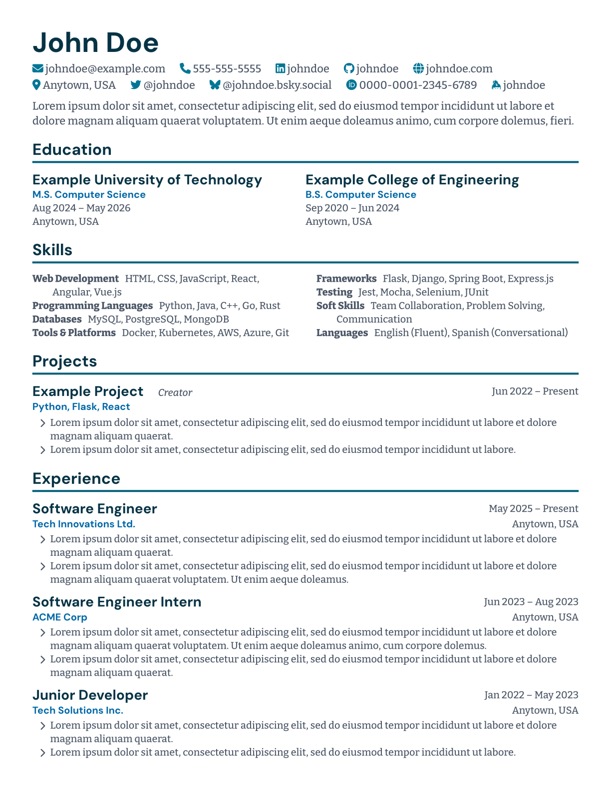

# libresume

libresume is a Typst template for creating resumes with a clean and modern design.

[](resume.typ)

## Usage

To use, clone/copy `libresume.typ` and `libtailwind.typ`. Then, in your Typst document:

```typst
#include "libresume.typ": *
#show: resume

= John Doe

// ...
```

See [`resume.typ`](resume.typ) for a complete example.

## Customization

You can supply a theme to customize the appearance of your resume. For example:

```typst
#include "libresume.typ": *
#show: resume.with(
    theme: (
        primary: teal,
        accent: emerald,
        neutral: stone,
        font-heading: "Inter",
        font-body: "Roboto",
    )
)
```

You can use any TailwindCSS color swatch (included with the template), or supply your own swatches for primary/accent/neutral in this format:

```typst
#let my-swatch = (
    s50: rgb("#f0f4f8"),
    s100: rgb("#d9e2ec"),
    s200: rgb("#bcccdc"),
    s300: rgb("#9fb3c8"),
    s400: rgb("#829ab1"),
    s500: rgb("#627d98"),
    s600: rgb("#486581"),
    s700: rgb("#334e68"),
    s800: rgb("#243b53"),
    s900: rgb("#102a43"),
    s950: rgb("#06172a"),
)
```

(Some shades are unused; see `libresume.typ` for which are actually required.)

## License

This project is licensed under the MIT License. See the [LICENSE](LICENSE) file for details.
